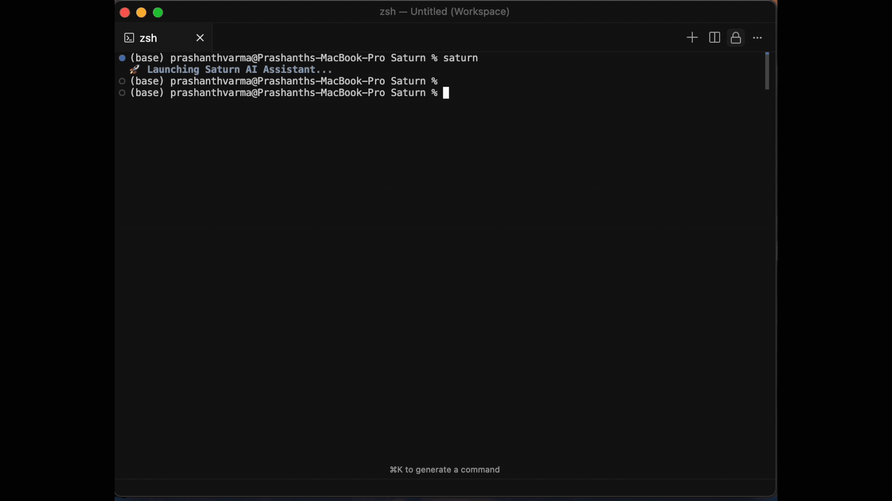

# Saturn - Smart Assistant for Translating User Requests
Your AI-powered control for cloud infrastructure.

[Saturn](https://github.com/vidhra/Saturn) is an open source conversational interface that translates into infra operations. We help in translating natural language into cloud API calls, making cloud infrastructure management accessible to everyone - from DevOps engineers to developers who want to focus on building, not configuring.



## Getting Started
- **Quick Start**: Install Saturn and run your first cloud command in minutes with our [installation guide](#setup)
- **Documentation**: Learn everything about Saturn's capabilities in our comprehensive docs
- **Run your first command**: `saturn run "Create a VPC in us-central1"` - it's that simple
- **Explore examples**: Check out our [examples directory](./examples/) for real-world use cases
- **Need help?** We're available on [GitHub Issues](https://github.com/vidhra/Saturn/issues) - feel free to reach out and join our community!

## ⚡ Saturn in Action

Transform complex cloud operations into simple conversations:

```bash
# Instead of memorizing complex gcloud commands...
saturn run "Create a serverless VPC access connector named 'dev-connector' in us-central1 with IP range 10.9.0.0/28 in the default network."

# Or automating multi-step workflows...
saturn run "Set up a complete CI/CD pipeline with Cloud Build triggers for my GitHub repo"

# Even complex infrastructure provisioning...
saturn run "Deploy a load-balanced web application with auto-scaling enabled"
```

## 🚀 Key Features

**🤖 Natural Language Processing**: Speak to your cloud infrastructure 
**☁️ Multi-Cloud Ready**: Currently supports Google Cloud Platform and AWS with azure support coming soon  
**🧠 RAG-Powered Intelligence**: Leverages comprehensive cloud documentation for accurate command generation  
**📊 State Management**: Complete audit trail and state tracking for all operations  
**🔧 Extensible Architecture**: Easy to add new cloud providers and services  
**⚡ Fast & Reliable**: Built with Python and trying to optimize for production workloads

## 🛠️ Saturn Tools

Saturn provides a comprehensive toolkit for cloud operations:

- **saturn run**: Execute natural language cloud commands with AI assistance
- **saturn ingest-docs**: Build and maintain RAG knowledge bases from cloud documentation
- **Built-in State Tracking**: Automatic logging and state management for all operations
- **Multi-Provider Support**: Extensible architecture for different cloud providers
- **Rich CLI Interface**: Beautiful terminal interface with help and options

## Setup

### Prerequisites
- Python 3.10 or higher
- Google Cloud SDK and AWS CLI 
- API keys for your preferred LLM provider (OpenAI, Google Gemini, Anthropic Claude, or Mistral)

### Quick Installation

#### Option 1: Using UV (Recommended - Faster)

1. **Install UV (if not already installed):**
   ```bash
   # On macOS and Linux
   curl -LsSf https://astral.sh/uv/install.sh | sh
   
   # On Windows
   powershell -c "irm https://astral.sh/uv/install.ps1 | iex"
   
   # Or via pip
   pip install uv
   ```

2. **Clone and install:**
   ```bash
   git clone https://github.com/vidhra/saturn.git
   cd saturn
   uv sync
   saturn --help  # Verify installation
   ```

3. **For GPU support:**
   ```bash
   uv sync --extra gpu-support
   ```

#### Option 2: Traditional pip Installation

1. **Clone and install:**
   ```bash
   git clone https://github.com/vidhra/saturn.git
   cd saturn
   python -m venv venv
   source venv/bin/activate  # On Windows: .\venv\Scripts\activate
   pip install -e .
   pip install torch --index-url https://download.pytorch.org/whl/cu121 # for gpu support
   ```

### Configuration

1. **Configure your environment:**
   ```bash
   # Create your configuration
   cp config.yaml.example config.yaml
   
   # Set up your API keys (create .env file)
   echo "OPENAI_API_KEY=your-key-here" > .env
   echo "GCP_PROJECT_ID=your-project-id" >> .env
   ```

2. **Authenticate with Google Cloud:**
   ```bash
   gcloud auth application-default login
   ```

3. **Ready to go!**
   ```bash
   # With UV
   saturn run "List all my compute instances"
   
   # With pip (in activated venv)
   saturn run "List all my compute instances"
   ```

## Configuration

Saturn uses a flexible configuration system with `config.yaml` and environment variables:

```yaml
# config.yaml
llm_provider: openai  # 'gemini', 'claude', 'mistral'
gcp_project_id: your-gcp-project-id
kb_path: api_defs
max_retries: 3
```

```bash
# .env file (keep this secure!)
OPENAI_API_KEY=sk-xxxxxxxxxxxxxxxxxxxxxxxxxxxxxxxxxxxxxxxxxxxxxxxx
GEMINI_API_KEY=xxxxxxxxxxxxxxxxxxxxxxxxxxxxxxxxxxxxxxx
GCP_PROJECT_ID=your-gcp-project-id
```

## RAG Engine & Knowledge Base

Saturn includes a powerful RAG (Retrieval Augmented Generation) engine that ensures accurate cloud operations by leveraging comprehensive documentation:

### Setup RAG Knowledge Base
```bash
# Install RAG dependencies
pip install llama-index>=0.10.0 llama-index-embeddings-huggingface>=0.1.0

# Ingest cloud documentation
saturn ingest-docs --vector-store chroma --docs-path ./internal/tools/gcloud_online_docs_markdown

# Run with RAG enhancement
saturn run "Create a secure GKE cluster with private nodes" --vector-store chroma
```

### Supported Vector Stores
- **ChromaDB**: Persistent, production-ready vector database
- **DuckDB**: Lightweight, embedded vector storage
- **In-Memory**: Fast, session-based storage for development

## Usage Examples

### Basic Operations
```bash
# Infrastructure provisioning
saturn run "Create a new VPC named 'production-vpc' in us-west1"

# Service management  
saturn run "Deploy a Cloud Function that responds to Pub/Sub messages"

# Security configuration
saturn run "Set up IAM roles for a new development team"
```

### Advanced Workflows
```bash
# Multi-step operations
saturn run "Set up a complete web application stack with load balancer, auto-scaling, and Cloud SQL database"

# Specify custom options
saturn run "Create a GKE cluster" --project-id my-project --provider gemini --max-retries 5
```

## State Tracking & Logging

Saturn automatically tracks all operations with detailed logging:

```json
{
  "run_info": {
    "query": "Create a VPC connector",
    "status": "COMPLETED",
    "start_time": "2024-01-15T10:30:00Z",
    "end_time": "2024-01-15T10:31:23Z"
  },
  "nodes": [
    {
      "tool": "gcp_executor",
      "status": "COMPLETED",
      "command": "gcloud compute networks vpc-access connectors create...",
      "output": "Created connector [dev-connector]"
    }
  ]
}
```

Logs are automatically saved to `logs/saturn_run_<query>_<timestamp>_<uuid>.json`.

## Community

Join our growing community of cloud engineers, DevOps professionals, and developers who are revolutionizing how we interact with cloud infrastructure. Share knowledge, contribute to the project, and help us make cloud operations more accessible to everyone.

### Contributing

We welcome contributions of all kinds:

- **🐛 Bug Reports**: [Create an issue](https://github.com/vidhra/saturn/issues) for any bugs you encounter
- **💡 Feature Requests**: Share your ideas for new capabilities and integrations
- **📝 Documentation**: Help improve our docs and examples
- **🔧 Code Contributions**: Submit pull requests for bug fixes and new features
- **☁️ Cloud Provider Support**: Help us add support for additional cloud platforms

### Development Setup

#### With UV (Recommended for Development)

```bash
# Clone and set up development environment
git clone https://github.com/vidhra/saturn.git
cd saturn
uv sync --dev  # Install with development dependencies

# Run tests
pytest

# Run linting
black saturn/
flake8 saturn/

# Run the application
saturn run "Your query here"
```

#### Traditional Development Setup

```bash
# Clone and set up development environment
git clone https://github.com/vidhra/saturn.git
cd saturn
python -m venv venv
source venv/bin/activate
pip install -e ".[dev]"

# Run tests
python -m pytest

# Run linting
black saturn/
flake8 saturn/
```

### Why UV?

UV is a fast Python package manager that offers several advantages over traditional pip:

- **🚀 Speed**: 10-100x faster dependency resolution and installation
- **🔒 Reliability**: Consistent, reproducible environments with lock files
- **💾 Disk Space**: Efficient caching and deduplication
- **🔄 Compatibility**: Works with existing pip and pyproject.toml workflows
- **🛠️ Developer Experience**: Better error messages and modern tooling

The `uv.lock` file ensures all developers and CI/CD systems use identical dependency versions, preventing "works on my machine" issues.

## Roadmap

🚀 **Coming Soon:**
- **AWS Support**: Complete Amazon Web Services integration
- **Azure Integration**: Microsoft Azure API support  
- **Terraform Generation**: Convert natural language to Infrastructure as Code
- **Kubernetes Operators**: Native Kubernetes resource management
- **Web Interface**: Browser-based GUI for Saturn operations
- **Team Collaboration**: Multi-user environments with role-based access

## Architecture

Saturn is built with a modular, extensible architecture:

```
├── saturn/           # Core Saturn package
│   ├── cli.py       # Command-line interface
│   ├── orchestrator.py # AI orchestration engine
│   ├── rag_engine.py   # RAG knowledge system
│   ├── gcp_executor.py # Google Cloud operations
│   ├── aws_executor.py # AWS operations (coming soon)
│   └── ...
├── model/           # Data models and schemas
├── internal/        # Internal tools and utilities
├── examples/        # Usage examples and tutorials
└── docs/           # Documentation
```

## License

Saturn is released under the MIT License. See [LICENSE](LICENSE) for details.

## Support & Contact

- **GitHub Issues**: [Report bugs and request features](https://github.com/vidhra/saturn/issues)
- **Email**: [root@vidhra.com](root@vidhra.com) for general inquiries
- **Documentation**: [Coming soon] - Comprehensive docs and tutorials

---

⭐ **Star us on GitHub** if Saturn helps streamline your cloud operations!

*Making infrastructure as easy as having a conversation.*
